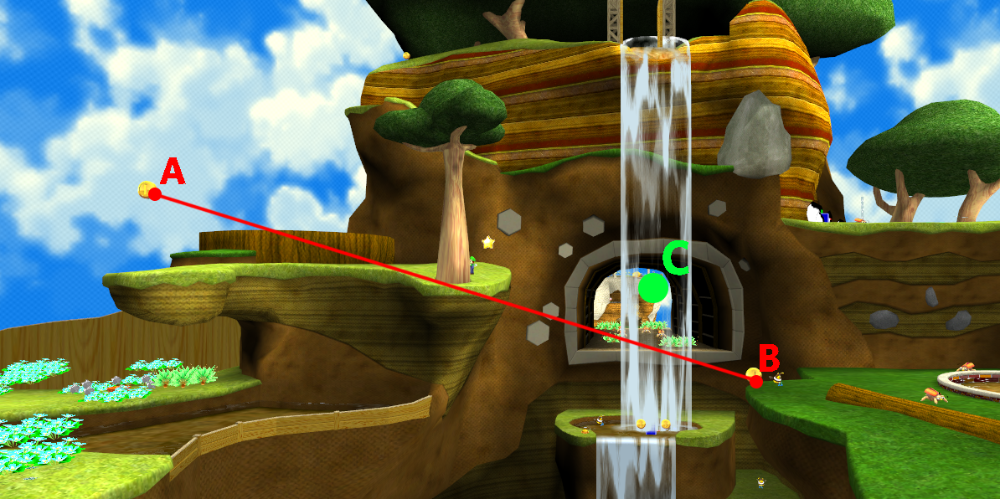
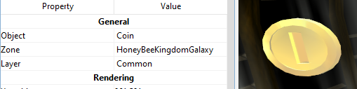
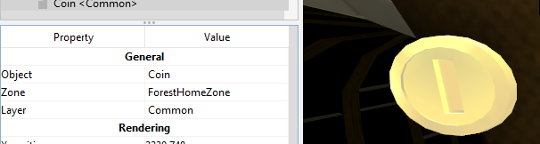
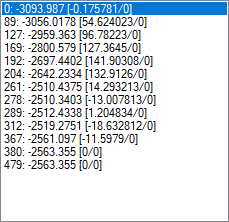
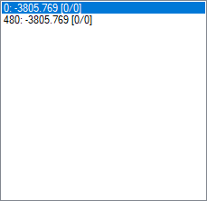
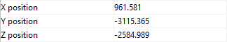

# Intro Camera Editing

Intro cameras are what you see as soon as the level is loaded. The little preview that shows you what the level is about\! First impressions are key and if your intro camera is the default flip swap pan forward camera that clips into a platform, you won't make a good impression. So that's where people usually do one of two things\! Either they delete the camera so it just starts instantly, or, what we're covering here, you make a custom one\! So let's get to that\!

## Prerequisites

* You'll need [WiiExplorer](https://github.com/SuperHackio/WiiExplorer) and [Launch Cam Plus](https://github.com/SuperHackio/LaunchCamPlus), by Super Hackio, and your levels *Map.arc* file.
* You *should* have [Whitehole Neo](https://github.com/SMGCommunity/Whitehole-Neo) to see coordinates for camera position (using a reference object).

### General tips and non-essential guidelines
*(How to make your camera make sense for your level)*

* Keep it simple \- you don't want 20 camera cuts in the 8 seconds (480 frames) the default camera length lasts, try and keep it to 2, *maybe* 3 cuts.  
* Remember the focus \- if your level is linear and has a set end location, it's always nice to have an intro camera end on the location of the star. For open world levels, maybe show the location of one of the objectives. Like if it's a silver star level, maybe give a subtle hint as to where one of the silver stars are.

## Preparations

To start, open your levels *Map.arc* file, then in the *camera* folder, extract the *StartScenario\#.canm* file. (\# being the number for the scenario that uses this camera). 

Honeyhive Galaxy’s Map.arc file. (Please note that SMG1 has its internal files in lowercase. Capitalization doesn’t matter in SMG2, but in SMG1, files MUST be all lowercase.)

Then, open Launch Cam Plus, click File \> Open, then find the CANM you extracted. This will open the CANM editor.

## Getting Started with CANM editing 

Opening the CANM file will present you with, well, quite a lot. But don’t worry, it’s a lot more simple than it looks. 

### Keyframe Types

*Position XYZ* is where the camera is ***located*** in the galaxy

*Target XYZ* is where the camera is ***looking*** in the galaxy

*Roll* is the ***Rotation*** of the camera. From \-180 to 180\. Either \-180 or 180 is exactly upside down. 0 is straight up.   

And finally, *Field of View* *(or FOV)* is how ***zoomed in*** the camera is.

### Coordinates

Coordinates in a galaxy can be easily found by placing a reference object in your level. Here, I’ll be using a coin, so when I mention the coin, I mean whatever object you use as a reference.

Say you want to make a simple intro camera. The camera moves from point A to B (red) while looking at point C (green) which does not move.

I have already placed coins in these positions, as you can see, and will use the positions of those coins (visible in Whitehole) as keyframe points. This camera will only use 2 time keyframes. 

---

### Make sure your reference objects are in the <u>___MAIN GALAXY___</u>, not the zone!

`HoneyBeeKingdomGalaxy`✅

`ForestHomeZone`❌

---

Now, this might be confusing, so I'll try and go through this as step-by-step as possible.

First, let's set up the keyframes. It'll be easier if we set these up first, trust me.

Starting off, for a simple Point A to B camera, you'll want to make 2 camera timing points for each Position and Target entry. Under `Keyframe Data` you can enter the frame number in the `Time` slot.

If you're opening a CANM file from the base game, you'll see a lot of timing points. You'll probably want to delete most of the existing ones. Especially for a simple camera such as the one we're making here.

 Before
 After

(Tip, you can press CTRL + A to create a new timing point, and CTRL + DEL to delete the currently highlighted timing point.)

Next, look at the position of coin A.

Take note of these coordinates. Then, in LaunchCamPlus, take the X, Y, and Z positions from coin A, and put them in the corresponding `Position` sections first frames.

## Examples

### *Roll:* 0 to -180

### *Roll:* 0 to +180

### *Field of View:* 0 to 90

*Written by Syreyup*